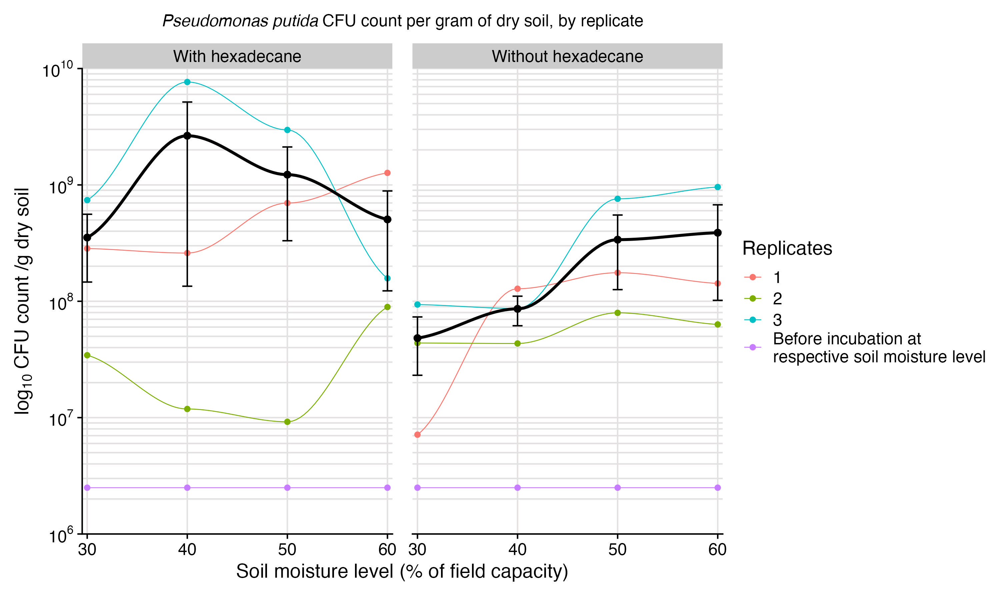
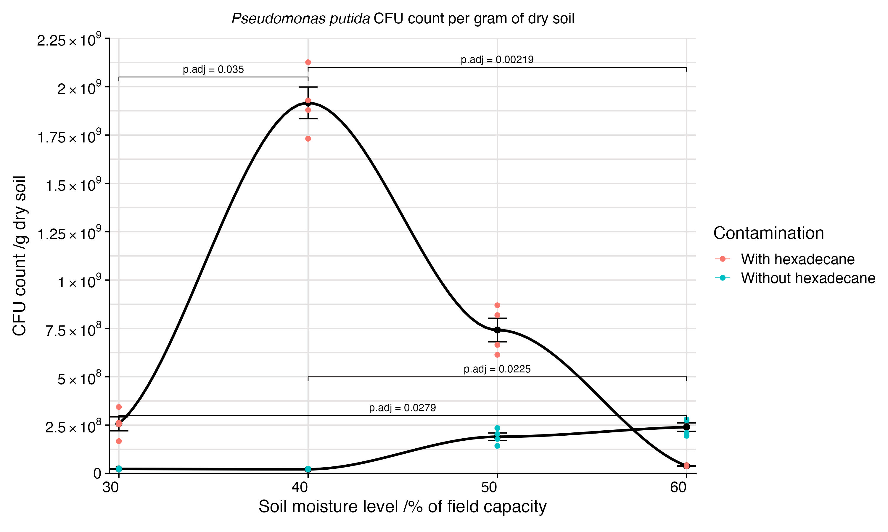

<html lang="en">
<head>
  <meta charset="UTF-8">
  <meta name="viewport" content="width=device-width, initial-scale=1.0">
  <title>README - Pseudomonas putida Soil Moisture Study</title>
</head>
<body>

<h1>The Effect of Soil Moisture Content on the Growth and Hexadecane Remediation Capacity of <em>Pseudomonas putida</em></h1>

<strong>Author:</strong> Y3948024

<strong>Date:</strong> 15-04-2025

<h2>License</h2>

This project is licensed under the MIT License - see the <a href="LICENSE">LICENSE</a> file for details.

<h2>Project Overview</h2>

This project investigates how different soil moisture levels affect the growth of <em>Pseudomonas putida</em> and its ability to remediate hexadecane, a common hydrocarbon pollutant. The aim is to understand bioremediation potential in various environmental conditions, inspired by real-world oil spills, such as those in dry Libya or the humid Ecuadorian Amazon.

<h2>Project Structure</h2>
<ul>
  <li><code>/analysis/</code> – Analysis files, including .pdf, respective .md, .html files, and all required files for knitting. Data files are located here so that the .rmd can knit successfully.</li>
  <li><code>/analysis/data</code> – Tidy data files</li>
  <li><code>/figures/</code> – Statistical plots and figures</li>
  <li><code>/data_gel_image</code> – Annoted gel image from practical 1b</li>
  <li><code>/code/</code> – Scripts for producing figures and analysis</li>
</ul>

<h2>Data Description</h2>
<ul>
  <li><code>cfu_per_g_d_soil_allgroups.xlsx</code> – General data for all groups</li>
  <li><code>cfu_per_g_d_soil_group3.xlsx</code> – Detailed spot replicate data for group 3</li>
  <li><code>data_gel_image</code> – PCR gel image confirming bacterial identity</li>
</ul>

<h2>Methods and Analysis</h2>
<ul>
  <li>CFU counts determined by spot plating after serial dilutions</li>
  <li>Confirmed bacterial identity via oxidase test, microscopy, selective media, and PCR</li>
  <li>Statistical analysis conducted using R 4.4.1 with packages including <code>tidyverse</code>, <code>ggplot2</code>, <code>FSA</code>, <code>vegan</code>, and <code>rcompanion</code></li>
  <li>Tests included Shapiro-Wilk for normality of residuals, Levene's test for variance homogeneity, and Scheirer–Ray–Hare non-parametric tests with Dunn's post-hoc corrections</li>
</ul>

<h2>Results Summary</h2>
<ul>
  <li>At the group level (means across replicates), no significant effect of soil moisture or hexadecane presence was observed.</li>
  <li>Spot replicate analysis (group 3) indicated significant interaction effects between moisture content and hexadecane contamination (p = 0.0017).</li>
  <li>Significant differences detected between moisture levels 30% vs 40%, and 40% vs 60%, depending on contamination status.</li>
</ul>

<h2>Statistical Analysis Tables</h2>

<h3>Shapiro-Wilk Test (Normality of Residuals)</h3>
<table border="1">
<tr><th>Test</th><th>W</th><th>p-value</th></tr>
<tr><td>Group-level residuals</td><td>0.73228</td><td>2.775e-05</td></tr>
<tr><td>Group 3 residuals</td><td>0.96822</td><td>0.4519</td></tr>
</table>

<h3>Levene's Test (Homogeneity of Variance)</h3>
<table border="1">
<tr><th>Group</th><th>F value</th><th>p-value</th></tr>
<tr><td>Group-level data</td><td>1.3126</td><td>0.2903</td></tr>
<tr><td>Group 3 spot replicates</td><td>0.0223</td><td>0.9954</td></tr>
</table>

<h3>Scheirer-Ray-Hare Test</h3>
<table border="1">
<tr><th>Effect</th><th>H</th><th>p-value</th></tr>
<tr><td>Plate (group level)</td><td>1.9667</td><td>0.57935</td></tr>
<tr><td>Contamination (group level)</td><td>1.6133</td><td>0.20402</td></tr>
<tr><td>Plate x Contamination (group level)</td><td>1.0467</td><td>0.78996</td></tr>
<tr><td>Plate (group 3)</td><td>3.8217</td><td>0.281369</td></tr>
<tr><td>Contamination (group 3)</td><td>10.2647</td><td>0.001356</td></tr>
<tr><td>Plate x Contamination (group 3)</td><td>15.0951</td><td>0.001737</td></tr>
</table>

<h2>Figures</h2>

<h3>Figure 1</h3>

<em>Fig. 1. Log10 CFU count of P. putida per gram of dry soil with or without hexadecane, across different soil moisture levels (30%, 40%, 50%, 60% of field capacity) with LOESS regression lines. Each replicate is a separate plate.</em>

<h3>Figure 2</h3>

<em>Fig. 2. CFU count of P. putida per gram of dry soil with or without hexadecane, across different soil moisture levels (30%, 40%, 50%, 60% of field capacity), for a single biological replicate, with LOESS regression lines.</em>

<h2>How to Reproduce</h2>

<h2>IMPORTANT</h2>

You should set the working directory as the path to Y3948024 on YOUR machine

<pre><code>setwd("path/to/Y3948024")</code></pre>

I have done this in console in order to remain anonymous for the project submission

<h3>Required Libraries</h3>
<pre><code>library(tidyverse)
library(ggplot2)
library(FSA)
library(readxl)
library(scales)
library(vegan)
library(rcompanion)
library(ggpubr)
library(car)
</code></pre>

<h3>Steps</h3>
<ol>
  <li>Clone or download this repository</li>
  <li>Navigate to <code>/Y3948024/data</code> and load the Excel sheets</li>
  <li>Run R scripts to process data (filtering, factor conversion)</li>
  <li>Apply statistical tests and visualisations as demonstrated</li>
</ol>

<h2>References</h2>
<ul>
  <li>Dunn, O.J. (1964). <em>Multiple comparisons using rank sums</em>. Technometrics, 6(3), pp. 241–252.</li>
  <li>Fox, J. and Weisberg, S. (2019). <em>An R Companion to Applied Regression</em>. 3rd edn. Thousand Oaks, CA: Sage.</li>
  <li>Kassambara, A. (2023). <em>ggpubr: 'ggplot2'-Based Publication Ready Plots</em>. R package version 0.6.0.</li>
  <li>Levene, H., 1960. Robust tests for equality of variances. In: I. Olkin, ed. 1960. Contributions to probability and statistics: essays in honor of Harold Hotelling. Stanford: Stanford University Press, pp.278–292.</li>
  <li>Mangiafico, S. (2024). <em>rcompanion: Functions to Support Extension Education Programme Evaluation</em>. R package version 2.4.30.</li>
  <li>Ogle, D.H. et al. (2024). <em>FSA: Fisheries Stock Analysis</em>. R package version 0.9.5.</li>
  <li>Oksanen, J. et al. (2022). <em>vegan: Community Ecology Package</em>. R package version 2.6-4.</li>
  <li>R Core Team (2024). <em>R: A Language and Environment for Statistical Computing</em>. Vienna: R Foundation for Statistical Computing.</li>
  <li>Scheirer, C.J., Ray, W.S., and Hare, N. (1976). <em>The analysis of ranked data derived from completely randomised factorial designs</em>. Biometrics, 32(2), pp. 429–434.</li>
  <li>Shapiro, S.S. and Wilk, M.B. (1965). <em>An analysis of variance test for normality (complete samples)</em>. Biometrika, 52(3/4), pp. 591–611.</li>
  <li>Wickham, H. (2016). <em>ggplot2: Elegant Graphics for Data Analysis</em>. New York: Springer.</li>
  <li>Wickham, H. et al. (2019). <em>Welcome to the tidyverse</em>. R package version 2.0.0.</li>
  <li>Wickham, H. and Bryan, J. (2023). <em>readxl: Read Excel Files</em>. R package version 1.4.3.</li>
  <li>Wickham, H. and Seidel, D. (2022). <em>scales: Scale Functions for Visualisation</em>. R package version 1.3.0.</li>
</ul>

<h2>Acknowledgements</h2>

Thanks to the BABS2 Grand Challenge organisers, and all contributors to the R ecosystem used in this project.

Contributions are welcome through pull requests.

</body>
</html>
